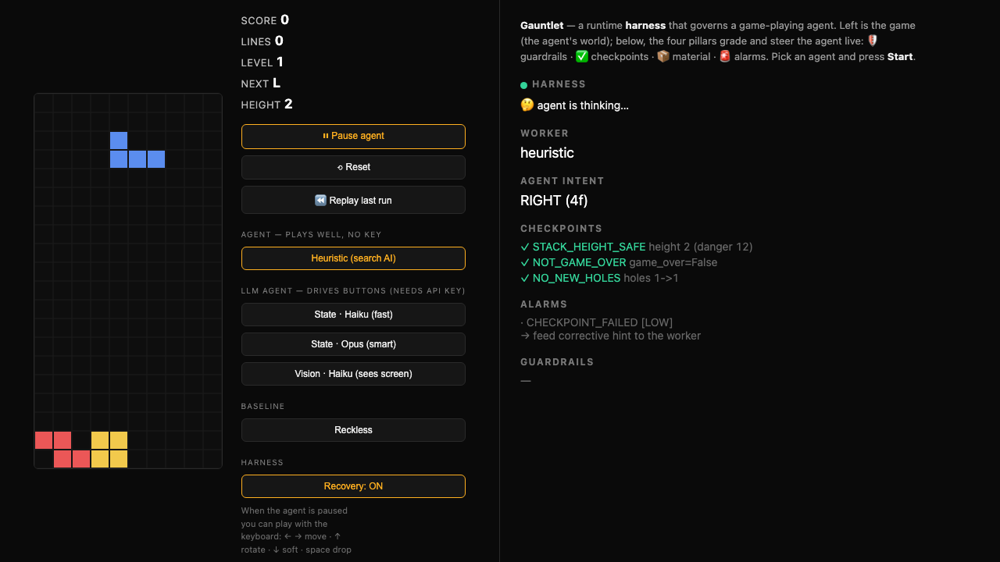

# Joypad Harness

▶ **[Watch the demo video](docs/demo.mp4)** (~3.5 min) — the four pillars, human escalation, live dual-worker recovery, and a real LLM driving the controller.

**A runtime harness that governs a game-playing AI agent.** The harness is the
cage the agent lives in: it decides which controller inputs are legal, grades the
agent's progress, carries game state in and out, and raises structured alarms.
When the agent fails, the harness feeds corrective feedback, hands off to a
recovery worker, and escalates to a human when even that can't save the run.

> Agents focus on tasks. Harnesses focus on constraints. A well-designed harness
> makes constraint-handling invisible to the agent.

[](docs/demo.mp4)

## The four pillars (each a separate component, governed apart from the agent)

| Pillar | What it does | Code |
|---|---|---|
| 🛡️ **Guardrails** | Declared rules on controller input, checked *before* execution | `harness/guardrails.py` |
| ✅ **Checkpoints** | Explicit pass/fail on real progress (stack height, holes, game-over) | `harness/checkpoints.py` |
| 📦 **Material handling** | Capture/normalize state, persist every step, replay a run | `harness/material.py` |
| 🚨 **Alarms** | Structured `{type, severity, context, recommended_action}` | `harness/alarms.py` |

The agent (the **worker**) is deliberately *not* a pillar — it's the thing being
governed, and it's swappable (`workers/`). The harness only knows one interface:
`decide(state, feedback) -> action`.

## The agents (workers) — swap any of them in live

| Worker | What it is | Plays well? |
|---|---|---|
| **heuristic** | A real Tetris search AI (El-Tetris), no LLM | Yes — clears lines, stays flat |
| **claude (state/vision)** | A modern **LLM** driving the controller by reading the board (text) or *seeing the screen* (image) | It's a real AI under governance — imperfect, which is the point |
| **reckless** | A dumb baseline that stacks recklessly | No — demos the harness catching a bad agent |

The harness governs all three identically. When the LLM (or reckless) gets stuck,
the harness **hands off to the heuristic recovery worker**, then hands back once
safe — a real safety-system pattern (capable fallback + human escalation).

Demo domain: **Tetris** (a custom browser game). The game runs in the browser
(the agent's "world"); the Python harness drives and grades it over WebSocket.

## Run it

```bash
uv venv .venv && uv pip install --python .venv -r requirements.txt
.venv/bin/python -m pytest -q        # 46 tests — the verification hook
./run.sh                              # serve at http://127.0.0.1:8000
```

Open the URL, press **Start** (defaults to the heuristic — plays cleanly, no key),
then swap to the LLM or reckless and watch the four pillars react. The Claude
worker needs `ANTHROPIC_API_KEY`; heuristic and reckless don't.

### Deploy

The game runs in the viewer's browser, so the harness is a plain web app — no
headless browser server-side.

```bash
# Render: connect the repo at render.com → New → Blueprint (uses render.yaml + Dockerfile)
```

Set `ANTHROPIC_API_KEY` as a secret to enable the LLM worker in production
(optional — the heuristic runs with no key).

## How the pieces fit

```
browser (Tetris + dashboard) ⇄ WebSocket ⇄ FastAPI ⇄ HarnessSession
                                                       ├─ decide():  🛡️ guardrails + worker
                                                       └─ observe(): ✅ checkpoints 📦 material 🚨 alarms
```
Full design: **[HARNESS.md](HARNESS.md)**. Build log: [PROGRESS.md](PROGRESS.md).

## Honest note on the LLM

An LLM driving Tetris by buttons plays poorly — it buries holes (which are
permanent in Tetris) and rarely clears lines, regardless of model or perception
mode. That's not a bug; it's the difficulty of the task. The harness's value is
exactly this: **governing a real, fallible AI** — grading it, nudging it, handing
off to a reliable fallback, and escalating to a human. The heuristic shows the
harness governing a *competent* agent; the LLM shows it governing a *real* one.

**Update:** an LLM *can* play well once the harness does the geometry for it — see
[docs/LLM_GAMEPLAY.md](docs/LLM_GAMEPLAY.md). Pure LLM planning clears ~0 lines
(even Opus); when the harness enumerates legal placements and the model just
*judges* them (the **Pick · Haiku** agent), it clears lines steadily. Perception
and strategy were never the wall — execution was, and that's the harness's job.

## Deliverables

- [x] 1-page Harness Planning Document
- [x] Project repo
- [ ] Deployed Harness URL
- [x] `HARNESS.md` — architecture & design
- [x] Demo video — [docs/demo.mp4](docs/demo.mp4)
